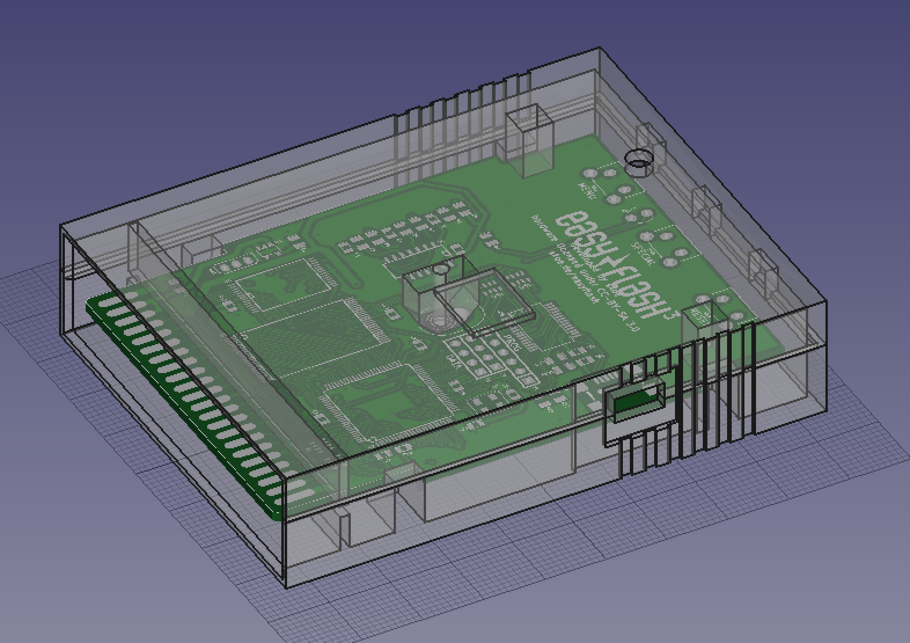

# EasyFlash3 case

Designed for extra printability. Just print the STLs with the outer sides laying on the printbed (you might need to rotate the top side 180º).

Recommended settings:

- 3 mm brim and/or heated bedto avoid cornerwarp
- 0.3 mm layer height or thinner for higher detail
- 20% infill

Use a 16 x 3 mm countersunk screw to secure the parts together.

FreeCAD source available.

CC-NC-BY-SA license (credit me, don't sell it without my permission and share with the same license).

## Thanks

Skoe: you are THE man.